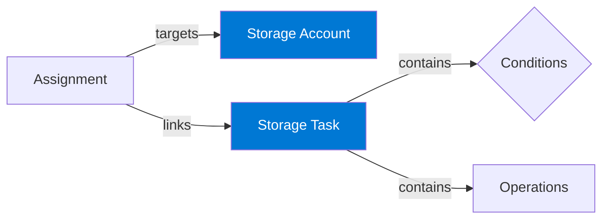

[azure-storage-actions.pdf](./docs/azure-storage-actions.pdf) (downloaded 10/4/2025 from https://learn.microsoft.com/en-us/azure/storage-actions/storage-tasks/) provides a comprehensive guide to Azure Storage Actions, a serverless framework for automating data management tasks across Azure Blob Storage and Azure Data Lake Storage.

### Key Features:

*   **Automated Data Operations:** Perform tasks like moving data to different storage tiers, managing data retention, and organizing data with blob index tags and metadata.
*   **Codeless Automation:** Automate these operations without writing any code.
*   **Scalability:** Manage millions of objects across multiple storage accounts.

### Core Concepts:

*   **Storage Task:** A resource that defines the data operations to be performed based on a set of conditions.
*   **Conditions:** Rules that determine which objects a storage task will operate on. Conditions consist of one or more clauses that evaluate properties of the objects.
*   **Operations:** The actions that a storage task performs on objects that meet the defined conditions.
*   **Assignment:** A resource that links a storage task to a specific storage account and defines when the task runs and where execution reports are stored.

### Management and Implementation:

The document provides detailed instructions on how to create and manage storage tasks and assignments using various tools:

*   **Azure Portal:** A visual interface for creating and managing storage tasks.
*   **PowerShell:** Use the `Az.StorageAction` module to script and automate storage task management.
*   **Azure CLI:** Use the `az storage-actions` command to manage storage tasks from the command line.
*   **ARM Templates, Bicep, and Terraform:** Define storage tasks as infrastructure-as-code for repeatable deployments.
*   **.NET:** Use the Azure Storage Actions client library for .NET to programmatically manage storage tasks.

### Best Practices and Considerations:

*   **Permissions:** Proper RBAC roles are required to manage storage tasks and for tasks to perform operations on storage accounts.
*   **Validation:** Use the condition preview feature to test the impact of a storage task before enabling it.
*   **Scalability:** For large-scale operations, consider segmenting tasks by prefix and staggering their schedules.
*   **Monitoring:** Monitor task executions and review reports to ensure that tasks are running as expected.
*   **Cost Management:** Understand the billing model for Azure Storage Actions, which includes charges for task execution, objects targeted, and operations performed.

### Known Issues and Limitations:

The document also outlines several known issues and limitations, such as:

*   Billing does not show the task assignment name.
*   Task assignments are not updated when the task definition changes.
*   Restrictions on moving storage tasks between regions or subscriptions.
*   Concurrency limits for task execution on a single storage account.

### Top Advantages:

1.  **Serverless Automation:** It provides a fully managed, serverless framework, meaning you don't have to provision or manage any compute infrastructure to run your data management tasks.
2.  **No-Code/Low-Code Operations:** You can define complex data management workflows based on conditions and operations without writing any code, significantly lowering the barrier to entry.
3.  **Massive Scalability:** It's designed to perform operations on millions or even billions of objects across multiple storage accounts efficiently.
4.  **Centralized Management:** You can define a single task and apply it to numerous storage accounts, simplifying the management of data policies across your entire Azure environment.
5.  **Cost Optimization:** It helps automate lifecycle management, such as moving infrequently accessed data to cheaper storage tiers, which can lead to significant cost savings.
6.  **Robust Monitoring and Alerting:** Deep integration with Azure Monitor provides detailed execution reports and performance metrics. This enables proactive alerting on failures and offers a comprehensive audit trail for compliance and troubleshooting.

### Top 5 Disadvantages:

1.  **Billing Obscurity:** Billing meters are associated only with the storage account name, not the task assignment name. This makes it difficult to correlate costs with specific automation tasks, especially in environments with many assignments.
2.  **Static Task Assignments:** When you update a storage task's definition, the changes do not automatically apply to existing assignments. You must delete the old assignments and create new ones to pick up any changes, which can be a cumbersome and error-prone process.
3.  **Inflexible Resource Management:** You cannot move storage tasks or their assignments between different resource groups or subscriptions. This lack of portability can be a significant issue for organizations that need to reorganize their Azure resources.
4.  **Concurrency Limits:** There is a limit to the number of task assignments that can run concurrently on a single storage account. This can create bottlenecks and requires careful scheduling to ensure tasks complete in a timely manner without being paused.
5.  **Limited Private Network Support:** In PREVIEW regions, operating on storage accounts within a private network (with IP or network access restrictions) is unsupported. Tasks require access via a public endpoint, which can be a security concern and a blocker for organizations with strict network policies.
6.  **No Event-Driven Triggers:** The service operates on a scheduled basis (e.g., daily). It does not support true real-time, event-driven triggers that execute the instant a blob is created or modified. This results in a "near real-time" execution model with inherent latency.