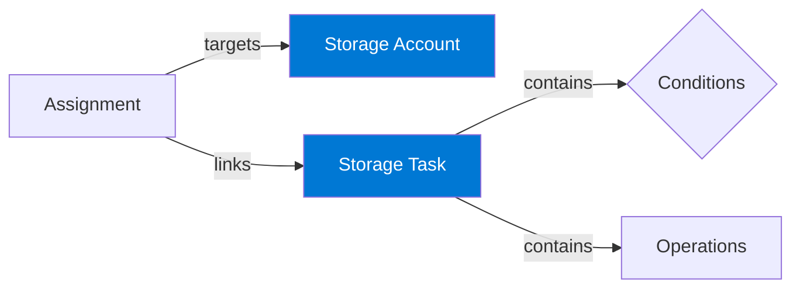

[azure-storage-actions.pdf](./docs/azure-storage-actions.pdf) (downloaded 10/4/2025 from https://learn.microsoft.com/en-us/azure/storage-actions/storage-tasks/) provides a comprehensive guide to Azure Storage Actions, a serverless framework for automating data management tasks across Azure Blob Storage and Azure Data Lake Storage.

### Key Features:

*   **Automated Data Operations:** Perform tasks like moving data to different storage tiers, managing data retention, and organizing data with blob index tags and metadata.
*   **Codeless Automation:** Automate these operations without writing any code.
*   **Scalability:** Manage millions of objects across multiple storage accounts.

### Core Concepts:

*   **Storage Task:** A resource that defines the data operations to be performed based on a set of conditions.
*   **Conditions:** Rules that determine which objects a storage task will operate on. Conditions consist of one or more clauses that evaluate properties of the objects.
*   **Operations:** The actions that a storage task performs on objects that meet the defined conditions.
*   **Assignment:** A resource that links a storage task to a specific storage account and defines when the task runs and where execution reports are stored.

### Management and Implementation:

The document provides detailed instructions on how to create and manage storage tasks and assignments using various tools:

*   **Azure Portal:** A visual interface for creating and managing storage tasks.
*   **PowerShell:** Use the `Az.StorageAction` module to script and automate storage task management.
*   **Azure CLI:** Use the `az storage-actions` command to manage storage tasks from the command line.
*   **ARM Templates, Bicep, and Terraform:** Define storage tasks as infrastructure-as-code for repeatable deployments.
*   **.NET:** Use the Azure Storage Actions client library for .NET to programmatically manage storage tasks.

### Supported Storage Types

Azure Storage Actions is a highly specialized service designed exclusively for managing data within **Azure Blob Storage**. It does not support other Azure Storage data services like Files, Queues, or Tables.

| Storage Type | Supported by Azure Storage Actions? | Notes |
| :--- | :--- | :--- |
| **Azure Blobs (Standard)** | ✅ **Yes (Full Support)** | This is the primary target for the service. All features, such as tiering and tagging, are fully supported. |
| **Azure Data Lake Storage Gen2** | ✅ **Yes (Adapted Support)** | Explicitly supported, but with a key difference: you must use blob **metadata** for conditions, as blob index tags are not available on hierarchical namespace accounts. |
| **Azure Files** | ❌ **No** | The service does not operate on file shares. All features and operations are blob-specific. |
| **Azure Queues** | ❌ **No** | The service is for managing data at rest, not for processing messages in a queue. |
| **Azure Tables** | ❌ **No** | The service operates on unstructured objects (blobs), not on structured data within a NoSQL table. |

### Best Practices and Considerations:

*   **Permissions:** Proper RBAC roles are required to manage storage tasks and for tasks to perform operations on storage accounts.
*   **Validation:** Use the condition preview feature to test the impact of a storage task before enabling it.
*   **Scalability:** For large-scale operations, consider segmenting tasks by prefix and staggering their schedules.
*   **Monitoring:** Monitor task executions and review reports to ensure that tasks are running as expected.
*   **Cost Management:** Understand the billing model for Azure Storage Actions, which includes charges for task execution, objects targeted, and operations performed.

### Known Issues and Limitations:

The document also outlines several known issues and limitations, such as:

*   Billing does not show the task assignment name.
*   Task assignments are not updated when the task definition changes.
*   Restrictions on moving storage tasks between regions or subscriptions.
*   Concurrency limits for task execution on a single storage account.

### Key Advantages:

1.  **Serverless & Scalable:** Provides a fully managed, serverless framework that automatically scales to operate on billions of objects without requiring infrastructure management.
2.  **No-Code & Centralized:** Allows you to define complex data policies once without writing code and apply them centrally across numerous storage accounts, simplifying management.
3.  **Secure & Auditable:** Operates with credential-free **Managed Identities** and provides detailed, per-object execution reports, offering a robust security posture and a clear audit trail for compliance.
4.  **Production-Safe:** Automatically **throttles its own performance** based on the available capacity of the storage account, ensuring that background data management tasks do not disrupt primary application workloads.
5.  **DevOps Ready:** The entire configuration, from tasks to assignments, is fully manageable as **Infrastructure as Code** (Bicep, ARM, Terraform), enabling version control, peer review, and automated, repeatable deployments.
6.  **Cost Optimization:** Enables automated data lifecycle management, such as tiering infrequently accessed data to cheaper storage, which can significantly reduce costs at scale.

### Key Disadvantages:

1.  **Scheduled, Not Real-Time:** The service operates on a schedule (with a minimum of one day for recurring tasks) and lacks instantaneous, event-driven triggers, making it unsuitable for use cases requiring immediate action.
2.  **Inconsistent Feature Parity:** Key operations may be missing for certain storage configurations (e.g., the inability to **set blob metadata** on accounts with a hierarchical namespace), preventing consistent policy application everywhere.
3.  **Complex Change Management:** Task definitions are not dynamically linked to their assignments. Applying an update to a task's logic requires deleting and recreating all of its associated assignments, which can be cumbersome and error-prone.
4.  **Cost & Performance Opacity:** Billing is not granular to the specific task assignment, making precise cost attribution difficult. Similarly, performance is intentionally variable, which makes predicting exact job completion times challenging.