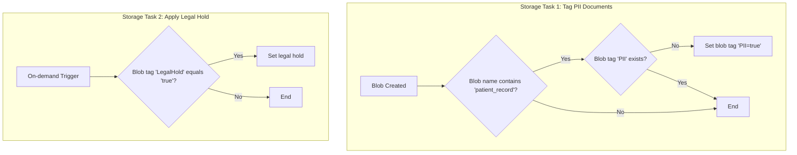
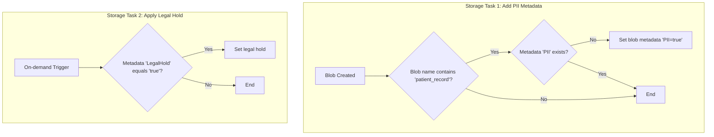

## Use Case 3: Enforcing Data Governance with Blob Tags and Metadata

**Scenario:** A healthcare organization stores patient records in Azure Blob Storage. To comply with data privacy regulations, they need to ensure that all documents containing personally identifiable information (PII) are tagged appropriately. They also need to apply a legal hold to certain documents to prevent them from being deleted.

> **Note on "Real-Time" Execution:** The term "runs in real-time" in this context means the task is automated and runs on a frequent, recurring schedule (e.g., daily). Azure Storage Actions is a scheduled, batch-oriented service, not an instantaneous, event-driven one. For true real-time processing (triggering within seconds of a blob's creation), a service like Azure Event Grid combined with Azure Functions would be more appropriate.

The implementation of this solution depends on whether the storage account has a hierarchical namespace enabled. Below are two reference architectures to address this.

---

### Solution 1: For Standard Blob Storage (using Blob Index Tags)

This approach is ideal for standard blob storage accounts as it leverages queryable blob index tags for efficient filtering.

1.  **Storage Task 1: Tag PII Documents**
    *   **Condition:**
        *   `Blob name` `contains` `patient_record`.
        *   `Blob tag` `PII` `does not exist`.
    *   **Operation:**
        *   `Set blob tags` with `PII = true`.
    *   **Assignment:**
        *   This task is assigned to the storage account containing patient records and runs in real-time as new blobs are created.

2.  **Storage Task 2: Apply Legal Hold**
    *   **Condition:**
        *   `Blob tag` `LegalHold` `equals` `true`.
    *   **Operation:**
        *   `Set legal hold`.
    *   **Assignment:**
        *   This task is assigned to the same storage account and runs on-demand when a legal hold is required.

---

### Solution 2: For Hierarchical Namespace Storage (using Blob Metadata)

> **Limitation Warning:** As of the documentation provided (`azure-storage-actions.pdf`), this solution is **not fully supported**. While Azure Storage Actions **can read** blob metadata to evaluate conditions, it **does not provide an operation to set or modify blob metadata**. The `Set blob metadata` operation described below is hypothetical and would be required for this use case to be fully implemented.

This approach is for storage accounts with a hierarchical namespace (Azure Data Lake Storage Gen2), which do not support blob index tags. Instead, it uses blob metadata.

1.  **Storage Task 1: Add PII Metadata**
    *   **Condition:**
        *   `Blob name` `contains` `patient_record`.
        *   `Metadata.Value['PII']` `does not exist`.
    *   **Operation:**
        *   `Set blob metadata` with `PII = true`.
    *   **Assignment:**
        *   This task is assigned to the storage account containing patient records and runs in real-time as new blobs are created.

2.  **Storage Task 2: Apply Legal Hold based on Metadata**
    *   **Condition:**
        *   `Metadata.Value['LegalHold']` `equals` `true`.
    *   **Operation:**
        *   `Set legal hold`.
    *   **Assignment:**
        *   This task is assigned to the same storage account and runs on-demand when a legal hold is required.

---

### Feature Comparison: Standard vs. Hierarchical Namespace

The choice between using blob index tags and metadata is dictated by the storage account type. Here is a summary of the differences in how Azure Storage Actions interacts with each:

| Feature | Standard Blob Storage | Hierarchical Namespace Storage |
| :--- | :--- | :--- |
| **Primary Attribute Type** | Blob Index Tags | Blob Metadata |
| **Attribute Read/Evaluation**| ✅ Supported (e.g., `Tags.Value['PII']`) | ✅ Supported (e.g., `Metadata.Value['PII']`) |
| **Attribute Write/Modification**| ✅ Supported (`SetBlobTags` operation) | ❌ **Not Supported** (No `SetBlobMetadata` operation) |
| **Queryability** | High (Tags are indexed by Azure) | Low (Metadata is not indexed) |
| **Supported Operations** | All operations apply | All operations apply, except for writing metadata |

This use case demonstrates the principles of using Azure Storage Actions to enforce data governance policies. While the solution for standard blob storage is fully supported, the approach for hierarchical namespaces is currently limited by the absence of an operation to modify blob metadata.

---

### Verification and Monitoring

To ensure that all blobs are processed correctly and to maintain a robust audit trail, you can use the following built-in features:

1.  **Execution Reports:** After each task run, a detailed CSV report is generated in a designated storage container. This report lists every blob that was evaluated and shows whether the operation was a `Success` or `Failed`. For any failures, it provides an error code and description, offering a complete audit log for troubleshooting.

2.  **Azure Monitor Metrics:** The **Overview** page for the storage task in the Azure portal provides high-level metrics, such as `Total number of objects where an operation succeeded` and `Total number of objects where an operation failed`. A quick glance at these metrics can confirm if any errors occurred during a run.

3.  **Azure Monitor Alerts:** For proactive notification, you can configure alerts in Azure Monitor. Create a rule that triggers if the `Total number of objects where an operation failed` metric rises above zero. This can automatically send an email or other notification to the operations team, ensuring a rapid response to any issues.

4.  **Auditing Task (Optional):** For maximum assurance, you can create a secondary, read-only "auditing" task that runs periodically. This task's condition would be designed to find non-compliant blobs (e.g., a `patient_record` blob where the `PII` tag does not exist). The task would have no operation, but its execution report would serve as a regular compliance check, listing any blobs that have fallen through the cracks.

---

### Operational Considerations: Advantages and Disadvantages

When implementing this data governance scenario in a real-world production environment, several key operational factors come into play.

#### Advantages

*   **Secure by Design:** The use of **Managed Identities** for authentication eliminates the need to manage secrets like connection strings or SAS tokens, providing a more secure, credential-free solution.
*   **Safe for Production:** The service's **automatic throttling** ensures that these background governance tasks will not overwhelm the storage account and impact the performance of critical, user-facing applications.
*   **Auditable and Compliant:** The **per-object execution reports** provide a detailed and immutable audit trail, which is essential for proving compliance in regulated industries like healthcare.
*   **Repeatable and Safe:** The conditional logic (e.g., checking if a tag `does not exist`) makes the tasks **idempotent**. This means they are safe to re-run without causing unintended side effects or extra cost, which is critical for reliable automation.
*   **DevOps Ready:** The entire configuration can be defined as **Infrastructure as Code** (using Bicep, ARM, or Terraform), allowing for version control, peer review, and automated, consistent deployments.

#### Disadvantages

*   **No Real-Time Execution:** The service is **schedule-based** (e.g., daily), not event-driven. This means there will be a latency (up to the schedule's interval) between a blob's creation and its tagging, which may not be acceptable for all compliance scenarios.
*   **Key Feature Limitation:** The inability to **modify blob metadata** is a significant blocker for the hierarchical namespace (ADLS Gen2) solution, making the governance pattern inconsistent across different storage account types.
*   **Initial Scan Cost:** The first time the task runs on a container with a large volume of existing data, it will incur a one-time cost for scanning every object (the "Day One" problem). This needs to be planned for and potentially managed by rolling out the task incrementally.
