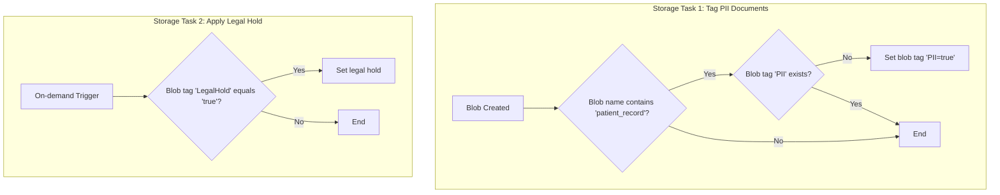
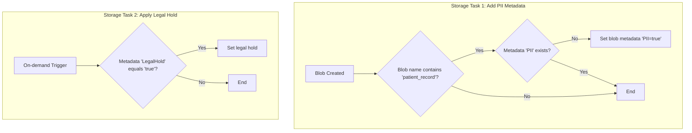

## Use Case: Enforcing Data Governance with Blob Tags and Metadata

**Scenario:** A healthcare organization stores patient records in Azure Blob Storage. To comply with data privacy regulations, they need to ensure that all documents containing personally identifiable information (PII) are tagged appropriately. They also need to apply a legal hold to certain documents to prevent them from being deleted.

> **Note on "Real-Time" Execution:** The term "runs in real-time" in this context means the task is automated and runs on a frequent, recurring schedule (e.g., daily). Azure Storage Actions is a scheduled, batch-oriented service, not an instantaneous, event-driven one. For true real-time processing (triggering within seconds of a blob's creation), a service like Azure Event Grid combined with Azure Functions would be more appropriate.

The implementation of this solution depends on whether the storage account has a hierarchical namespace enabled. Below are two reference architectures to address this.

---

### Solution 1: For Standard Blob Storage (using Blob Index Tags)

This approach is ideal for standard blob storage accounts as it leverages queryable blob index tags for efficient filtering.

1.  **Storage Task 1: Tag PII Documents**
    *   **Condition:**
        *   `Blob name` `contains` `patient_record`.
        *   `Blob tag` `PII` `does not exist`.
    *   **Operation:**
        *   `Set blob tags` with `PII = true`.
    *   **Assignment:**
        *   This task is assigned to the storage account containing patient records and runs in real-time as new blobs are created.

2.  **Storage Task 2: Apply Legal Hold**
    *   **Condition:**
        *   `Blob tag` `LegalHold` `equals` `true`.
    *   **Operation:**
        *   `Set legal hold`.
    *   **Assignment:**
        *   This task is assigned to the same storage account and runs on-demand when a legal hold is required.

---

### Solution 2: For Hierarchical Namespace Storage (using Blob Metadata)

This approach is for storage accounts with a hierarchical namespace (Azure Data Lake Storage Gen2), which do not support blob index tags. Instead, it uses blob metadata.

1.  **Storage Task 1: Add PII Metadata**
    *   **Condition:**
        *   `Blob name` `contains` `patient_record`.
        *   `Metadata.Value['PII']` `does not exist`.
    *   **Operation:**
        *   `Set blob metadata` with `PII = true`.
    *   **Assignment:**
        *   This task is assigned to the storage account containing patient records and runs in real-time as new blobs are created.

2.  **Storage Task 2: Apply Legal Hold based on Metadata**
    *   **Condition:**
        *   `Metadata.Value['LegalHold']` `equals` `true`.
    *   **Operation:**
        *   `Set legal hold`.
    *   **Assignment:**
        *   This task is assigned to the same storage account and runs on-demand when a legal hold is required.

This use case demonstrates how Azure Storage Actions can be adapted to enforce data governance policies and ensure compliance with regulations, regardless of the storage account's configuration.

---

### Verification and Monitoring

To ensure that all blobs are processed correctly and to maintain a robust audit trail, you can use the following built-in features:

1.  **Execution Reports:** After each task run, a detailed CSV report is generated in a designated storage container. This report lists every blob that was evaluated and shows whether the operation was a `Success` or `Failed`. For any failures, it provides an error code and description, offering a complete audit log for troubleshooting.

2.  **Azure Monitor Metrics:** The **Overview** page for the storage task in the Azure portal provides high-level metrics, such as `Total number of objects where an operation succeeded` and `Total number of objects where an operation failed`. A quick glance at these metrics can confirm if any errors occurred during a run.

3.  **Azure Monitor Alerts:** For proactive notification, you can configure alerts in Azure Monitor. Create a rule that triggers if the `Total number of objects where an operation failed` metric rises above zero. This can automatically send an email or other notification to the operations team, ensuring a rapid response to any issues.

4.  **Auditing Task (Optional):** For maximum assurance, you can create a secondary, read-only "auditing" task that runs periodically. This task's condition would be designed to find non-compliant blobs (e.g., a `patient_record` blob where the `PII` tag does not exist). The task would have no operation, but its execution report would serve as a regular compliance check, listing any blobs that have fallen through the cracks.
