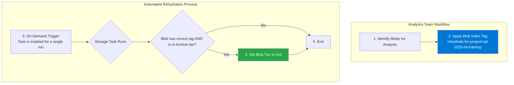
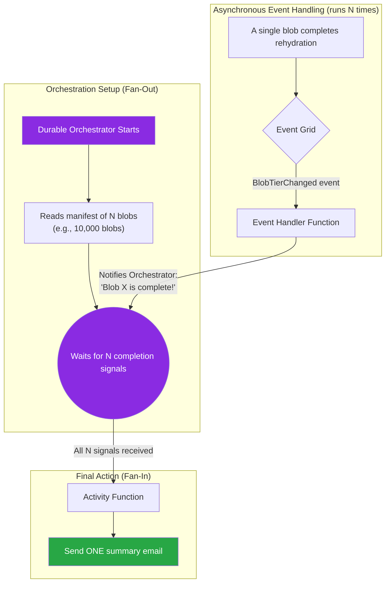

## Use Case 4: On-Demand Data Hydration for Analytics

**Scenario:** A global retail company archives petabytes of historical sales data, including transaction logs, customer behavior data, and inventory snapshots, to Azure Blob Storage in the **Archive tier** to minimize costs. The data analytics and machine learning (ML) teams periodically need to perform intensive, short-term analysis on specific subsets of this data—for example, to train a new ML model on all transaction data from a specific holiday season.

The key challenge is providing these teams with a secure, self-service, and cost-effective way to "rehydrate" (i.e., move) the exact data they need from the offline Archive tier to the online Hot tier for high-performance querying, without granting them broad permissions and without risking massive, accidental retrieval costs.

---

### Understanding the Challenge: The Cost and Latency of Archive Storage

Azure's **Archive tier** is an offline, low-cost storage solution designed for data that is rarely accessed. Its economics are built around a trade-off: in exchange for an extremely low storage price (pennies per terabyte per month), there are significant costs and delays associated with retrieving the data.

| Metric | Archive Tier | Hot Tier | Implication |
| :--- | :--- | :--- | :--- |
| **Storage Cost** | **Extremely Low** | High | Ideal for long-term data retention. |
| **Retrieval Latency**| **Up to 15 hours** | Milliseconds | Data is not instantly available; it must be "rehydrated." |
| **Retrieval Cost** | **High** | Free | Retrieving large volumes of data can be very expensive. |

A manual retrieval process is slow, requires elevated permissions, and is prone to human error. For example, an analyst accidentally requesting to rehydrate 500 TB of data instead of 5 TB could result in an unexpected bill for thousands of dollars. The goal is to create a controlled, automated workflow that mitigates these risks.

### Solution: A Tag-Based, On-Demand Rehydration Task

This solution uses a single, on-demand Azure Storage Actions task that is triggered by the analytics team. The team's only responsibility is to apply a specific blob index tag to the archived blobs they need. The storage task then handles the rehydration process automatically.

*   **Storage Task: Rehydrate Archived Data for Analytics**
    *   **Condition:**
        *   `Blob tag` `rehydrate-for-project` `equals` `q4-2025-ml-training`.
        *   `AND` `Blob tier` `equals` `Archive`.
    *   **Operation:**
        *   `Set blob tier` to `Hot`.
    *   **Assignment:**
        *   This task is assigned to the storage account containing the sales data. It is **disabled by default** and is only enabled by an automated system or a privileged operator for a single run when the analytics team makes a formal request.



#### Understanding the Asynchronous Rehydration Process

A critical aspect of this workflow is that the rehydration process is **asynchronous**. The `Set Blob Tier` operation does not instantly make the data available. The blob remains in the Archive tier and is unreadable until the process is fully complete, which can take several hours.

Here is a detailed breakdown of the states a blob goes through:

1.  **Initiation:** The Storage Actions task identifies a tagged blob and executes the `Set blob tier` operation. This is a non-blocking API call that simply **requests** the rehydration to begin. The task's execution report will show `Success` for this step, as the request was successfully submitted.

2.  **Rehydration in Progress:** The blob now enters a transitional state. If you were to query its properties, you would see:
    *   `accessTier`: **Archive** (The blob is still officially in the Archive tier).
    *   `archiveStatus`: **rehydrate-pending-to-hot** (A new property indicates the rehydration is in progress).
    During this time, the blob's content is **inaccessible**.

3.  **Completion:** Once Azure has finished copying the data to the online tier, the properties are updated:
    *   `accessTier`: **Hot**
    *   `archiveStatus`: `null` (The transitional status is removed).
    Only now is the blob fully online and its data accessible for analysis.

| State | `accessTier` Property | `archiveStatus` Property | Is Data Readable? |
| :--- | :--- | :--- | :--- |
| **Before Rehydration** | `Archive` | `null` | ❌ No |
| **During Rehydration** | `Archive` | `rehydrate-pending-to-hot` | ❌ No |
| **After Rehydration** | `Hot` | `null` | ✅ Yes |

**Key Implication:** The Storage Actions execution report **is not a "data is ready" notification**. The analytics team needs a separate mechanism—such as a simple monitoring script or an Azure Function—to periodically check the `accessTier` property of the requested blobs to confirm when the rehydration is complete.

---

### Architectural Decision: Why Blob Index Tags are Essential

For this use case, using a **standard blob storage account with Blob Index Tags is the only viable architecture**. Hierarchical namespace (ADLS Gen2) accounts are not suitable because they lack this critical feature.

*   **Queryability:** Blob index tags are indexed by the Azure Storage service. This allows the Storage Actions task to efficiently find the exact blobs that need to be rehydrated without having to perform a slow and costly scan of billions of objects in the archive.
*   **Attribute-Based Access Control (ABAC):** Tags are the foundation for a powerful security model. You can use Azure's ABAC feature to grant the analytics team permissions to *only read and write specific tags* (like `rehydrate-for-project`), without giving them permission to read the data itself or perform the high-cost `Set Tier` operation. This enforces the principle of least privilege.

| Feature | Standard Blob Storage (with Tags) | Hierarchical Namespace (with Metadata) |
| :--- | :--- | :--- |
| **Attribute Type** | Blob Index Tags | Blob Metadata |
| **Server-Side Querying**| ✅ **Supported** | ❌ Not Supported |
| **Attribute-Based Access**| ✅ **Supported** | ❌ Not Supported |
| **Recommendation** | ✅ **Highly Recommended** | ❌ Not Suitable |

---

### Self-Service Tagging with Security Guardrails

The analytics team needs a secure and user-friendly way to apply tags without being granted excessive permissions. The best practice is to combine a custom **Azure RBAC role** with an **Attribute-Based Access Control (ABAC) condition**.

#### 1. Create a Custom RBAC Role

First, a custom role is created that grants *only* the permission to read and write blob index tags.

*   **Required Action:** `Microsoft.Storage/storageAccounts/blobServices/containers/blobs/tags/write`

This can be defined with a JSON template and created using Azure CLI or PowerShell.

**`Blob Tagger Custom Role (JSON)`**
```json
{
  "name": "Storage Blob Index Tag Contributor",
  "description": "Allows reading and writing blob index tags, but not blob data.",
  "assignableScopes": [
    "/subscriptions/{your-subscription-id}"
  ],
  "permissions": [
    {
      "actions": [
        "Microsoft.Storage/storageAccounts/blobServices/containers/blobs/tags/read",
        "Microsoft.Storage/storageAccounts/blobServices/containers/blobs/tags/write"
      ],
      "notActions": [],
      "dataActions": [],
      "notDataActions": []
    }
  ]
}
```

#### 2. Assign the Role with an ABAC Condition

The custom role is assigned to the analytics team's Azure AD security group. Crucially, an **ABAC condition** is added to the assignment to ensure they can only use the specific tag key required for rehydration.

*   **Action:** `Microsoft.Storage/storageAccounts/blobServices/containers/blobs/tags/write`
*   **Condition:** `@RequestAction = 'Microsoft.Storage/storageAccounts/blobServices/containers/blobs/tags/write' AND @Resource.tags['rehydrate-for-project'] EXISTS`

This condition acts as a guardrail, ensuring the only tag key they can write or modify is `rehydrate-for-project`.

#### 3. Provide User-Friendly Tools

Once permissions are in place, the team can use standard tools to apply the tags:

*   **Azure Storage Explorer (Most User-Friendly):** Users can navigate to the container, select one or more blobs, right-click, and choose **"Edit Blob Index Tags"** to add the key `rehydrate-for-project` and the value `q4-2025-ml-training`.

*   **Azure CLI (For Scripting):** For power users or automating the tagging of many blobs.
    ```bash
    # Tag a single blob
    az storage blob tag set \
        --account-name "your-archive-account" \
        --container-name "sales-data" \
        --name "path/to/your/blob.csv" \
        --tags "rehydrate-for-project=q4-2025-ml-training" \
        --auth-mode login
    ```

*   **Azure PowerShell:** The equivalent for teams who prefer PowerShell.
    ```powershell
    # Tag a single blob
    Set-AzStorageBlobTag \
        -AccountName "your-archive-account" \
        -ContainerName "sales-data" \
        -BlobName "path/to/your/blob.csv" \
        -Tag @{ "rehydrate-for-project" = "q4-2025-ml-training" }
    ```

This model empowers the analytics team while maintaining strict central control over the high-cost rehydration operation.

#### 4. Define and Assign the Role as Code (Bicep)

For a repeatable, production-grade deployment, the custom role and its conditional assignment should be defined as Infrastructure as Code (IaC). This Bicep example demonstrates how to create the role and assign it to a security group for a specific storage account.

```bicep
// main.bicep

// Parameters for the analytics team's security group and the tag key
param analyticsSecurityGroupId string
param storageAccountName string
param location string = resourceGroup().location
param requiredTagKey string = 'rehydrate-for-project'

// Reference to the existing storage account
resource storageAccount 'Microsoft.Storage/storageAccounts@2023-01-01' existing = {
  name: storageAccountName
}

// Custom Role Definition
resource blobTaggerRole 'Microsoft.Authorization/roleDefinitions@2022-04-01' = {
  name: guid(subscription().id, 'Blob Tagger Role-Rehydration')
  properties: {
    roleName: 'Storage Blob Index Tag Contributor (Rehydration)'
    description: 'Allows writing the specific blob index tags required for data rehydration.'
    type: 'CustomRole'
    permissions: [
      {
        actions: [
          'Microsoft.Storage/storageAccounts/blobServices/containers/blobs/tags/write',
          'Microsoft.Storage/storageAccounts/blobServices/containers/blobs/tags/read'
        ]
        notActions: []
      }
    ]
    assignableScopes: [
      subscription().id
    ]
  }
}

// Role Assignment with ABAC Condition
resource roleAssignment 'Microsoft.Authorization/roleAssignments@2022-04-01' = {
  name: guid(storageAccount.id, 'rehydration-tagger-role-assignment')
  scope: storageAccount // Assigning at the storage account scope
  properties: {
    roleDefinitionId: blobTaggerRole.id
    principalId: analyticsSecurityGroupId
    principalType: 'Group'
    condition: '@Resource.tags[\\\'${requiredTagKey}\\\'] EXISTS'
    conditionVersion: '2.0'
  }
}
```

---

### Automating the Trigger: From Request to Execution

While the data selection is self-service for the analytics team, the execution of the high-cost rehydration task must be strictly controlled. A robust, enterprise-grade solution is to create an automated approval and trigger workflow using a tool like **Azure Logic Apps**, integrated with a corporate ticketing system (e.g., ServiceNow, Jira).

This approach provides a full audit trail for every rehydration request, ensuring that costs are approved and tracked.

```mermaid
graph TD
    subgraph "Request & Approval"
        A[1. Analyst creates ticket<br/>(e.g., in ServiceNow)] --> B{2. Approval Workflow};
        B -- Approved --> C[3. Ticket status updated];
    end

    subgraph "Automated Trigger"
        C -- Event triggers --> D[4. Logic App is invoked];
        D --> E[5. Get Task Assignment ID];
        E --> F[6. Enable Storage Task Assignment<br/>(for a single run)];
    end

    subgraph "Storage Actions"
        F --> G[7. Storage Task executes<br/>at its scheduled time];
    end

    style D fill:#8a2be2,color:#fff
    style F fill:#0078D4,color:#fff
```

#### Workflow Breakdown

1.  **Formal Request:** An analyst files a ticket in a system like ServiceNow, specifying the business justification and the exact tag value (e.g., `q4-2025-ml-training`) for the data they need.
2.  **Approval:** The request goes through a formal approval process, where a manager or cost center owner can review and approve the potential costs associated with the rehydration.
3.  **Automated Trigger:** Upon final approval, the ticketing system makes an API call (e.g., via a webhook) to trigger a **Logic App**.
4.  **Task Enablement:** The Logic App uses its Managed Identity, which has been granted the necessary RBAC permissions, to enable the specific, pre-existing Storage Task Assignment. The assignment is configured to run once and then disable itself.
5.  **Execution:** The Azure Storage Actions service picks up the enabled task and executes the rehydration as described previously.

This workflow provides the perfect balance: the analytics team is empowered to select data, but the organization retains strict, auditable control over the execution of costly operations.

---

### Tag Lifecycle and Cleanup

The rehydration process relies on the `rehydrate-for-project` tag, but once the data is in the Hot tier and the project is complete, this tag becomes obsolete. Leaving old tags in place creates clutter and introduces the risk of accidental re-processing in the future. A complete solution includes a second, scheduled task to handle tag cleanup.

*   **Storage Task: Clean Up Old Rehydration Tags**
    *   **Condition:**
        *   `Blob tier` `equals` `Hot`.
        *   `AND` `Blob tag` `rehydrate-for-project` `exists`.
        *   `AND` `Blob last modified time` is `older than 30 days`.
    *   **Operation:**
        *   `Set blob tags` to remove the `rehydrate-for-project` tag.
    *   **Assignment:**
        *   This task is assigned to the same storage account and runs on a recurring weekly or monthly schedule.

This simple, low-impact task ensures that the system remains clean and that tags accurately reflect the current state of the data, completing the lifecycle of the rehydration request.

---

### Verification and Monitoring

To ensure the process is working correctly and to provide visibility to the analytics team, the following monitoring strategy is essential:

1.  **Execution Reports:** The primary tool for verification. After the on-demand task run is complete, the generated CSV report serves as a manifest of all blobs that were successfully rehydrated. This report can be automatically delivered to the analytics team, notifying them that their data is ready in the Hot tier.

2.  **Azure Monitor Alerts:**
    *   **Failure Alert:** An alert should be configured to trigger if the `Total number of objects where an operation failed` metric is greater than zero. This immediately notifies the operations team of any issues with the rehydration process.
    *   **Completion Alert:** An alert on the `Total number of runs` metric can signal that the task has completed, triggering a downstream process to notify the analytics team.

3.  **Cost Monitoring:** A budget and alert should be set up in **Azure Cost Management** specifically for "Blob Write Operations" on the archive account. A sudden spike in this cost could indicate an unauthorized or misconfigured rehydration and needs to be investigated immediately.

---

### Tracking Rehydration Completion: The Orchestration Pattern

A critical challenge remains: the Storage Actions execution report confirms that the rehydration *request* was successfully submitted, not that the data is ready. Furthermore, a simple event subscription to the `BlobTierChanged` event would trigger a separate notification for every single rehydrated blob, creating an "email storm" for the end-user.

The solution is to implement a stateful orchestration pattern using **Azure Durable Functions**. This workflow treats the entire rehydration job as a single transaction, tracking the status of all individual blobs and sending only one consolidated notification upon completion.

#### The Fan-Out/Fan-In Tracking Pattern

At its core, this solution uses the "Fan-Out/Fan-In" pattern, which is ideal for managing and monitoring a large number of parallel, asynchronous operations. The Durable Functions orchestrator acts as a stateful manager for the entire job: it "fans out" by defining a list of all blobs it needs to track, and then "fans in" by waiting for a completion signal for each of those blobs before triggering a final action.



The following diagram shows how this tracking pattern fits into the complete, end-to-end workflow, from the moment the Storage Actions report is generated.

```mermaid
graph TD
    subgraph "Step 1: Report Generation"
        A[Storage Actions Run Completes] --> B[Writes Matched Blobs File];
        A --> C[Writes Success/Failure Files];
        A --> E[<b>Writes Run Status File (Manifest)</b>];
    end

    subgraph "Step 2: Precision Triggering"
        F{Event Grid};
        B -- "BlobCreated Event (Ignored)" --> F;
        C -- "BlobCreated Event (Ignored)" --> F;
        E -- "BlobCreated Event (MATCHES!)" --> F;
        F -- "Advanced Filter:<br/>subject ENDS WITH 'runstatus.json'" --> G[Event Grid-Triggered Function];
    end

    subgraph "Step 3: Orchestration & Notification"
        G -- "Starts Orchestrator" --> H[Durable Orchestrator];
        H -- "Reads 'Matched Blobs' file<br/>(now safe to do so)" --> I((Waits for all<br/>'BlobTierChanged' events));
        
        subgraph "Asynchronous Rehydration (Hours Later)"
            K[Individual Blobs Rehydrated] --> L{Event Grid};
        end

        L -- "'BlobTierChanged' events" --> M[Event Handler Function];
        M -- "Raises event to Orchestrator" --> I;
        
        I -- "All blobs complete" --> J[Activity: Send ONE Summary Email];
    end

    style E fill:#28a745,color:#fff
    style G fill:#28a745,color:#fff
    style J fill:#28a745,color:#fff
    style H fill:#8a2be2,color:#fff
    style I fill:#8a2be2,color:#fff
```

#### Workflow Breakdown

1.  **Precision Trigger on the "Manifest" File:** The Storage Actions service generates multiple files for its execution report. The final file, which contains the overall run status, serves as our reliable "manifest" or "commit" file. An **Event Grid subscription** is configured with an advanced filter to trigger an Azure Function *only* when the blob ending in `runstatus.json` (or the equivalent summary file) is created. This guarantees that all other report files are already present and complete.

2.  **Orchestrator Initiation:** The Event Grid-triggered function's sole responsibility is to start the **Durable Functions orchestrator**. The event payload provides the path to the manifest file, which acts as a unique ID for this rehydration job.

3.  **Reading the Manifest (Fan-Out):** The orchestrator starts and its first step is to call an "activity function" to read the `matchedBlobs.csv` file from the report directory. It now has the complete list of all blobs that are being rehydrated and knows the exact number of completion events it needs to wait for. The orchestrator then enters a "waiting" state (e.g., using `Task.WhenAll` in .NET).

4.  **Tracking Individual Completions (Fan-In):** A second, separate Event Grid-triggered function is subscribed to the `Microsoft.Storage.BlobTierChanged` event. As each blob completes its rehydration hours later, this function fires. Its only job is to "raise an event" to the running orchestrator, effectively telling it, "Blob X is now Hot." The orchestrator marks that blob's task as complete.

5.  **Final Notification:** Once the orchestrator has received a completion event for every blob in its manifest, the `Task.WhenAll` condition is met. It then calls a final activity function that sends a single, consolidated email to the user, confirming that their entire dataset is now available for analysis.

#### Why This is the Best Practice

*   **Reliable and Eliminates Race Conditions:** The workflow only begins when the final manifest file is written, guaranteeing the entire report is ready to be read.
*   **Solves the "Email Storm":** By managing the state of the entire batch, it ensures only one notification is sent upon full completion.
*   **Stateful and Resilient:** Durable Functions automatically checkpoints the workflow's state. If the system restarts, the orchestrator resumes waiting without losing track of progress.
*   **Efficient and Scalable:** The entire process is event-driven and serverless. The orchestrator consumes virtually no resources while it is dormant and waiting for events, making it extremely cost-effective and scalable.

### Operational Risks and Mitigation

#### Advantages

*   **Secure and Segregated Duties:** The analytics team can request data without ever having the dangerous permissions needed to perform the rehydration themselves. This is a powerful implementation of the **principle of least privilege**.
*   **Cost Control:** The on-demand, tag-based nature of the task prevents accidental, large-scale rehydration. Costs are only incurred for the specific, tagged data set.
*   **Auditable and Repeatable:** The process is fully auditable through the execution reports and the trigger automation (e.g., ticketing history). The use of tags makes the request explicit and the process easy to repeat.
*   **Self-Service (with Guardrails):** The data selection is a self-service function for the analytics team, empowering them while maintaining strict, centralized control over the high-cost trigger.
*   **DevOps Ready:** The entire workflow—the tasks, the security roles, the trigger logic, and the orchestration function—can be defined as **Infrastructure as Code (IaC)**.

#### Disadvantages and Risks

*   **Latency is High and Variable:** This is the primary trade-off. The workflow is for **planned analytics**, not immediate data access. The total time to data readiness is the sum of:
    1.  The time for the request to be approved and the task triggered.
    2.  The **up to 15-hour delay** for the rehydration from the Archive tier to complete.
    *   **Mitigation:** Clear communication and expectation management with the analytics teams are essential. The notification system should provide status updates (e.g., "Rehydration Started," "Rehydration Complete").

*   **Risk of Accidental Cost Overruns:** A user could mistakenly apply a project tag to a much larger dataset than intended (e.g., tagging an entire folder of 1 PB instead of a subfolder of 10 TB).
    *   **Mitigation:** Implement a **pre-flight check** in the trigger automation (the Logic App). Before enabling the task, the Logic App should first run a small script or function to query the total size of blobs with the requested tag. If the size exceeds a pre-defined threshold, the process is halted, and an alert is sent to the cost management team for manual review.

*   **Orchestration and Trigger Failures:** The notification workflow, while robust, is composed of multiple serverless components (Event Grid, Azure Functions). A failure in any of these could lead to a user's data being ready but them never being notified.
    *   **Mitigation:**
        1.  **Dead-Lettering:** Configure dead-letter queues for all Event Grid subscriptions. This captures any events that could not be delivered to the function, allowing for later reprocessing.
        2.  **Monitoring and Alerting:** Create alerts on the Azure Function App to detect a high failure rate or a function that has stopped executing entirely.
        3.  **Idempotency:** Ensure the entire workflow is idempotent. The orchestrator should be able to handle duplicate events without sending multiple notifications.

*   **Performance Throttling:** A large-scale rehydration is an I/O-intensive operation on the storage account. While Storage Actions automatically throttles to protect the account, this can extend the completion time if other critical applications are heavily using the account simultaneously.
    *   **Mitigation:** Schedule large rehydration tasks during off-peak hours when possible. For extremely large archives, consider a multi-account (sharded) architecture to isolate the I/O-intensive rehydration activity from other workloads.