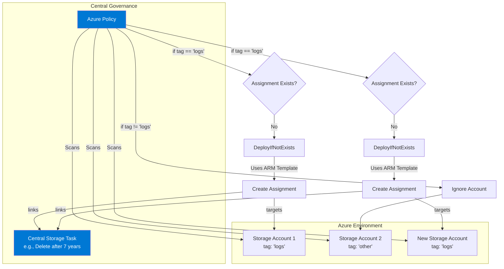

## Use Case 1: Automated Log Archiving and Deletion for Compliance

**Scenario:** A financial services company is required to retain application logs for a specific period to comply with industry regulations. They generate a large volume of logs daily, which are stored in Azure Blob Storage. The company needs to automatically archive logs older than 30 days to a cheaper storage tier and then permanently delete them after 7 years.

**Solution using Azure Storage Actions:**

1.  **Storage Task 1: Archive Old Logs**
    *   **Condition:**
        *   `Blob creation time` is `older than 30 days`.
        *   `Blob name` `ends with` `.log`.
    *   **Operation:**
        *   `Set blob tier` to `Archive`.
    *   **Assignment:**
        *   This task is assigned to the storage account containing the logs and is scheduled to run daily.

2.  **Storage Task 2: Delete Archived Logs**
    *   **Condition:**
        *   `Blob creation time` is `older than 7 years`.
        *   `Blob tier` is `Archive`.
    *   **Operation:**
        *   `Delete blob`.
    *   **Assignment:**
        *   This task is also assigned to the same storage account and runs daily.

This setup ensures that the company meets its compliance requirements without manual intervention, while also minimizing storage costs by moving old data to the archive tier.

---

### Important Implementation Note: Avoiding Conflicts

When implementing this solution, you **must** ensure that you do not have conflicting rules defined in the native **Azure Storage Lifecycle Management** feature for the same set of blobs.

The official documentation warns that if a Storage Action task attempts to delete a blob at the same time as a native lifecycle policy, it can lead to a "race condition." This will result in high failure rates in the Storage Action's execution report, creating operational noise and making it difficult to track legitimate failures.

**Recommendation:** Choose only one tool for a specific lifecycle action on a given data set. For this use case, you should rely exclusively on Azure Storage Actions for both archiving and deletion and disable any overlapping rules in the native lifecycle management configuration of the storage account.

---

### Scaling the Solution: Centralized Policy Management

The design of separating the **Storage Task** (the policy) from the **Assignment** (the target) is what makes this solution powerful for large enterprises.

*   **Define Once, Apply Everywhere:** The two storage tasks ("Archive Old Logs" and "Delete Archived Logs") can be defined once in a central, compliance-focused subscription.
*   **Apply to Hundreds of Accounts:** Administrators can then apply this centrally-managed policy to hundreds or even thousands of storage accounts across the organization simply by creating a new assignment for each one.
*   **Update Centrally:** If the company's retention policy changes (e.g., from 7 years to 10 years), the logic only needs to be updated in the single, central Storage Task. The change is automatically inherited by all assigned storage accounts on their next run, ensuring consistent compliance with minimal administrative effort.

> **Note on Scalability Constraints:** While this model is highly scalable, it's important to be aware of the service's defined limits. According to the documentation, a single storage task can have up to **5,000 assignments**, and a single storage account can receive up to **50 assignments** from different tasks. For most enterprise scenarios, these limits are very generous, but they should be considered during architectural planning.

#### Managing Policy Updates: A Critical Consideration

A significant operational limitation to be aware of is that **task assignments are not dynamically linked to the central task definition**. When an assignment is created, it takes a one-time copy of the task's logic.

This means if the company's retention policy changes (e.g., from 7 to 10 years), simply updating the central Storage Task is **not enough**. The existing assignments will continue to enforce the old 7-year policy.

To propagate a policy update, you must perform the following steps for all affected accounts:
1.  **Delete** the existing Storage Task Assignment.
2.  **Re-create** a new Assignment linked to the updated task.

Due to this manual "churn," managing this process at scale is only feasible through automation. It is highly recommended to manage the entire lifecycle of assignments as **Infrastructure as Code (IaC)** using tools like Bicep, ARM templates, or Terraform. This allows you to run a script or deployment pipeline to reliably delete and re-create the assignments across your entire environment.

---

### Automating Compliance with Azure Policy

To ensure that this compliance policy is automatically and consistently applied to all relevant storage accounts (both existing and new), the best practice is to leverage **Azure Policy**.

By creating a policy with a `DeployIfNotExists` effect, you can automate the assignment of your central storage tasks.

**How it Works:**

1.  **Establish a Tagging Standard:** A clear tagging convention is established. For example, any storage account that is intended to store application logs must be created with the tag `purpose: 'application-logs'`.

2.  **Create an Azure Policy Definition:** You create a custom policy that scans your environment for storage accounts with this tag. The policy logic is as follows:
    *   **`if`:** The resource is a storage account AND it has a tag `purpose` with the value `application-logs`.
    *   **`then`:** The policy checks for the existence of the required Storage Task Assignment (e.g., the one linking to the "Delete Archived Logs" task).
    *   **`DeployIfNotExists`:** If the assignment is missing, the policy triggers the deployment of an embedded ARM template to create it.

3.  **Assign the Policy:** The policy is assigned at a broad scope, such as a management group or an entire subscription.

**Benefits of this Approach:**

*   **Continuous Governance:** The policy runs continuously, ensuring that any new log storage account created is automatically made compliant.
*   **Remediation of Existing Resources:** Azure Policy can identify existing accounts that are non-compliant and can create remediation tasks to deploy the missing assignments.
*   **Centralized Audit:** The Azure Policy compliance dashboard provides a single pane of glass to view which storage accounts are compliant and which are not, serving as a powerful tool for audits.



---

### Advantages and Disadvantages of the Azure Policy Approach

While using Azure Policy is the recommended best practice for ensuring compliance at scale, it's important to understand its specific trade-offs.

#### Advantages

*   **Continuous Governance:** The policy automatically enforces compliance on all new resources and can remediate existing, non-compliant resources, providing a true "hands-off" governance solution.
*   **Built-in Auditing:** The Azure Policy compliance dashboard offers a centralized view to track which storage accounts are compliant, simplifying audits and security reviews.
*   **Scalability and Consistency:** The solution scales effortlessly from a few accounts to thousands, ensuring that the exact same configuration is applied everywhere and preventing configuration drift.

#### Disadvantages

*   **Initial Complexity:** Setting up a `DeployIfNotExists` policy requires knowledge of Azure Policy, ARM templates, and the permissions model for the policy's Managed Identity, making the initial setup more complex than a manual assignment.
*   **Elevated Permissions:** The Managed Identity for the policy assignment requires broad permissions (e.g., Storage Blob Data Owner) at the assigned scope (like a subscription), which must be carefully managed and audited.
*   **Evaluation Latency:** The process is not instantaneous. There is a natural delay for policy evaluation and the subsequent deployment, making it a "near real-time" solution, not an immediate one.
*   **Abstract Troubleshooting:** Debugging a failed deployment triggered by a policy can be less direct than troubleshooting a script, as it requires navigating through the policy compliance and deployment logs in the Azure portal.

---

### Automating Updates with Infrastructure as Code (Bicep)

For production environments, the most robust method for managing the lifecycle of assignments is to use an Infrastructure as Code (IaC) approach with a tool like Bicep. Instead of writing a script that performs actions, you define the *desired state* of all your resources in code.

When you need to update the retention policy, you modify the central Storage Task in your Bicep file and update a `version` parameter. When you redeploy the file, the Bicep engine detects this change and automatically updates all the assignments, handling the delete-and-recreate process seamlessly.

**Example Bicep Implementation:**

**`main.bicep`**
```bicep
// Define the central task
resource storageTask 'Microsoft.StorageActions/storageTasks@2023-01-01' = {
  name: 'Delete-Logs-After-10-Years' // The logic has been updated here
  location: resourceGroup().location
  properties: {
    description: 'Deletes logs older than 10 years.'
    enabled: true
    action: {
      if: {
        condition: '[[and(greater(Creation-Time, \'P10Y\'), endsWith(Name, \'.log\'))]]' // Example condition
        operations: [
          {
            name: 'DeleteBlob'
          }
        ]
      }
    }
  }
}

// Define a parameter for the policy version. Increment this to force an update.
param policyVersion string = 'v1.1'

// A list or parameter file of all target accounts
var logStorageAccounts = [
  'logaccountprod001'
  'logaccountprod002'
  'logaccountdev001'
]

// Loop to create an assignment for each account
module taskAssignments 'assignment.bicep' = [for accountName in logStorageAccounts: {
  name: 'assign-${accountName}'
  params: {
    storageAccountName: accountName
    taskResourceId: storageTask.id
    policyVersion: policyVersion // Pass the new version to the module
  }
}]
```

**`assignment.bicep` (Module)**
```bicep
param storageAccountName string
param taskResourceId string
param policyVersion string

// Get a reference to the existing storage account
resource storageAccount 'Microsoft.Storage/storageAccounts@2023-01-01' existing = {
  name: storageAccountName
}

// Define the assignment resource
resource assignment 'Microsoft.Storage/storageAccounts/storageTaskAssignments@2023-01-01' = {
  parent: storageAccount
  name: 'log-retention-policy'
  properties: {
    taskId: taskResourceId
    enabled: true
    description: 'Log retention policy. Version: ${policyVersion}' // The description includes the version
  }
}
```

This declarative approach is idempotent, integrates perfectly with CI/CD pipelines, and keeps your entire configuration version-controlled in Git, providing a clear history of changes.

---

### Operational Excellence: From Concept to Production

To transition this use case from a concept to a production-grade, resilient solution, the following operational aspects must be addressed:

1.  **Holistic Monitoring and Alerting:**
    *   **Heartbeat Alert:** Configure an alert that triggers if the task's `Total number of runs` is less than 1 over a 24-hour period. This detects silent failures where the task does not run at all.
    *   **Anomaly Detection:** Set up alerts for significant deviations in the number of objects processed. A sudden drop to zero could indicate an upstream problem (e.g., logs are no longer being generated), while a massive spike could signal a misconfiguration.
    *   **Compliance Drift Alert:** The most critical alert is on the optional "auditing task." An alert should fire if this task's report ever contains a non-zero number of non-compliant blobs, indicating that the primary task has failed or been bypassed.

2.  **Disaster Recovery (DR) Plan:**
    *   **Cross-Region Redeployment:** Since the entire configuration is defined in Bicep, the DR plan is to redeploy the same code to a designated secondary Azure region if the primary region fails.
    *   **Documented Failover Process:** The plan must clearly outline the steps to activate the DR task, including running the Bicep deployment in the secondary region and executing the automation to re-create the assignments to point to the new, geo-replicated task.

3.  **Security Hardening and Auditing:**
    *   **Least Privilege RBAC:** The Managed Identities for both the Storage Task and the Azure Policy assignment must be granted custom RBAC roles with the absolute minimum permissions required. For example, the task identity should only be allowed to `delete` and `write` (for tiering), not read the blob data itself.
    *   **Regular Access Reviews:** Implement recurring **Azure AD Access Reviews** for the high-privilege Managed Identities to ensure their permissions are still necessary and are periodically re-approved.

4.  **CI/CD Pipeline Safeguards:**
    *   **Pre-flight Validation:** The deployment pipeline must include a `what-if` stage and a manual approval gate. This allows an operator to review the exact impact of a change (e.g., "This will update 10,000 assignments") before it is applied to production.
    *   **Staged Rollout:** In large environments, the pipeline should be designed to roll out changes in batches (e.g., dev, then test, then production) to limit the blast radius of any potential issues.

5.  **Operational Runbook:**
    *   A detailed runbook is essential for the team operating the service. It should include a guide for on-call engineers on how to respond to each alert, steps for manual remediation if the automation fails, and a clear process for how new teams can onboard their storage accounts to the compliance policy.
