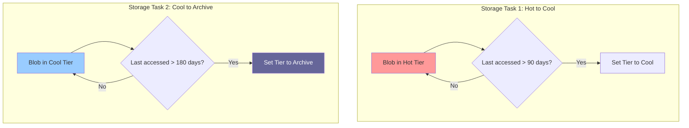
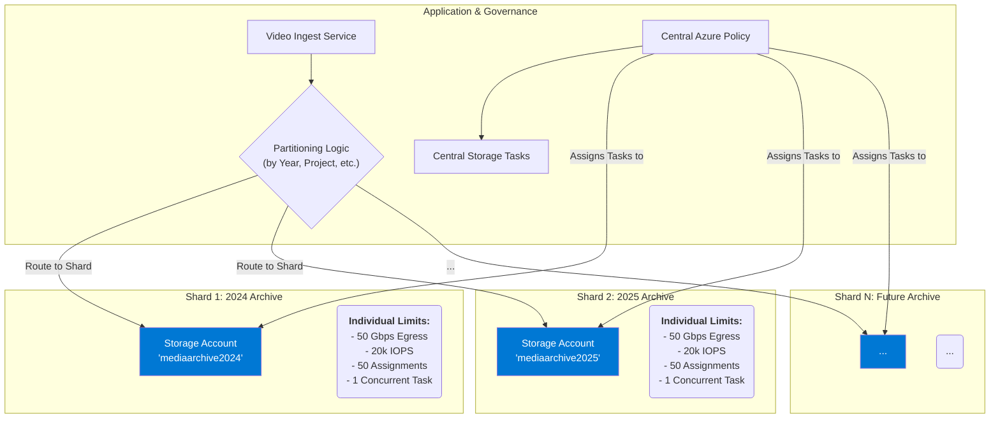
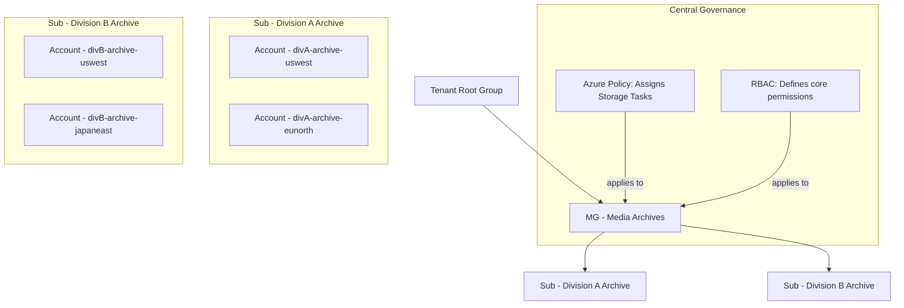

## Use Case 2: Data Lifecycle Management for a Media Company

**Scenario:** A media company stores large video files in Azure Blob Storage. To optimize costs, they want to move video files that haven't been accessed in the last 90 days to the Cool storage tier. If a video is still not accessed for another 90 days (i.e., 180 days total), it should be moved to the Archive tier.

---

### Understanding Azure Blob Storage Tiers for Cost Optimization

Azure Blob Storage provides several access tiers, allowing for significant cost optimization by matching the cost of storage to the data's access patterns. The core principle is a trade-off: the cheaper the storage cost per GB, the higher the cost and latency to retrieve the data. This model is ideal for a media library where assets naturally become less popular over time.

Here is a summary of the tiers relevant to this use case:

| Tier | Best For | Cost (per GB/month) | Retrieval Cost (per GB) | Retrieval Latency |
| :--- | :--- | :--- | :--- | :--- |
| **Hot** | Frequently accessed data | ~$0.018 | Free | **Milliseconds** |
| **Cool** | Infrequently accessed data (stored >= 30 days) | ~$0.01 | ~$0.01 | **Milliseconds** |
| **Cold** | Rarely accessed data (stored >= 90 days) | ~$0.0036 | ~$0.02 | **Milliseconds** |
| **Archive**| Long-term archival (stored >= 180 days) | ~$0.002 | ~$0.02 | **Up to 15 hours** |

**Key Takeaways:**

*   **Hot Tier:** Offers the lowest access cost and latency (milliseconds) but the highest storage cost. It is ideal for new uploads or popular videos that are actively streamed.
*   **Cool & Cold Tiers:** Provide cheaper storage for data that is accessed less frequently but still needs to be available instantly (milliseconds latency). They have minimum storage durations and per-GB retrieval fees.
*   **Archive Tier:** This is an **offline** tier with the lowest storage cost but the highest retrieval cost and latency. Data must be "rehydrated" to an online tier (Hot or Cool) before it can be accessed, a process that can take several hours. It is suitable for long-term preservation of content that is rarely, if ever, accessed.

By automating the transition from Hot to Cool and then to Archive, the company can dramatically reduce storage costs without manual intervention.

### Solution: Two Dedicated Storage Tasks

The correct and supported solution is to create two distinct storage tasks, each responsible for a specific step in the data's lifecycle. This ensures that the conditions for each tier transition are evaluated independently.

1.  **Storage Task 1: Move to Cool Tier**
    *   **Condition:**
        *   `Last access time` is `older than 90 days`.
        *   `AND` `Blob tier` `equals` `Hot`.
    *   **Operation:**
        *   `Set blob tier` to `Cool`.
    *   **Assignment:**
        *   This task is assigned to the storage account(s) containing the video files and is scheduled to run weekly.

2.  **Storage Task 2: Move to Archive Tier**
    *   **Condition:**
        *   `Last access time` is `older than 180 days`.
        *   `AND` `Blob tier` `equals` `Cool`.
    *   **Operation:**
        *   `Set blob tier` to `Archive`.
    *   **Assignment:**
        *   This task is also assigned to the same storage account(s) and runs weekly.

---

### Architectural Decision: Standard vs. Hierarchical Namespace Storage

A critical architectural decision is whether to use a standard blob storage account (flat namespace) or one with a hierarchical namespace (Azure Data Lake Storage Gen2). For a gigantic archive of large video files, the recommendation is to use a **standard ("flat") blob storage account**.

The primary reason is that standard accounts support **Blob Index Tags**. These are queryable, server-side key-value tags that allow you to find assets instantly without having to list and iterate through billions of files. For a massive archive, being able to find all videos with `projectID = 'Project-X'` without a costly client-side search is a game-changing capability. ADLS Gen2 does not support blob index tags; you are limited to blob metadata, which is not queryable by the storage service.

| Feature | Standard Blob Storage | Hierarchical Namespace (ADLS Gen2) | Recommendation for Media Archive |
| :--- | :--- | :--- | :--- |
| **Primary Use Case** | Object Storage (Store & Retrieve) | Big Data Analytics | ✅ **Standard Blob Storage** |
| **Cost Model** | Optimized for blob operations | Optimized for analytics workloads | ✅ **Standard Blob Storage** |
| **Queryable Tags** | ✅ **Blob Index Tags** | ❌ No (Metadata only) | ✅ **Standard Blob Storage** |
| **Directory Operations**| No (Simulated via prefixes) | ✅ Yes (Native folders) | ✅ **Standard Blob Storage** |

Choose ADLS Gen2 only if the primary purpose of the archive is to serve as a data source for frequent, large-scale analytics jobs (e.g., with Azure Databricks or Synapse) that require filesystem-level semantics and performance. For a "store and retrieve" media archive, this is unnecessary overhead.

---

### Important Implementation Note: Avoiding Conflicts

When implementing this solution, you **must** ensure that you do not have conflicting rules defined in the native **Azure Storage Lifecycle Management** feature for the same set of blobs.

The official documentation warns that if a Storage Action task attempts to modify a blob at the same time as a native lifecycle policy, it can lead to a "race condition." This will result in high failure rates in the Storage Action's execution report, creating operational noise and making it difficult to track legitimate failures.

**Recommendation:** Choose only one tool for a specific lifecycle action on a given data set. For this use case, you should rely exclusively on Azure Storage Actions for tiering and disable any overlapping rules in the native lifecycle management configuration of the storage account.

---

### Scaling the Solution: Centralized Policy Management

The design of separating the **Storage Task** (the policy) from the **Assignment** (the target) is what makes this solution powerful for large enterprises.

*   **Define Once, Apply Everywhere:** The two storage tasks ("Move to Cool" and "Move to Archive") can be defined once in a central, shared-services subscription.
*   **Apply to Hundreds of Accounts:** Administrators can then apply this centrally-managed policy to hundreds of storage accounts across the organization simply by creating new assignments for each one.
*   **Update Centrally:** If the company's tiering policy changes (e.g., from 90 days to 60 days), the logic only needs to be updated in the single, central Storage Task.

> **Critical Note on Policy Updates:** A significant operational limitation is that **task assignments are not dynamically linked to the central task definition**. When an assignment is created, it takes a one-time copy of the task's logic. To propagate a policy update, you must **delete and re-create** all existing assignments. This process should be managed as **Infrastructure as Code (IaC)** to ensure it can be done reliably at scale.

---

### Automating Compliance with Azure Policy

To ensure that this cost-optimization policy is automatically and consistently applied to all relevant storage accounts, the best practice is to leverage **Azure Policy**.

By creating a policy with a `DeployIfNotExists` effect, you can automate the assignment of your central storage tasks.

**How it Works:**

1.  **Establish a Tagging Standard:** Any storage account intended to store media assets must be created with the tag `content: 'media-library'`.
2.  **Create an Azure Policy Definition:** A custom policy scans for storage accounts with this tag. If an account is found to be missing the lifecycle task assignments, the policy triggers an ARM template deployment to create them.
3.  **Assign the Policy:** The policy is assigned at a broad scope, such as a management group or subscription, to ensure continuous governance.

This approach ensures that all new media storage accounts are automatically compliant with cost-optimization policies from the moment they are created.

---

### Verification and Monitoring

To ensure the lifecycle policy is working correctly and to track its impact, you can use the following features:

1.  **Execution Reports:** After each weekly run, a detailed CSV report is generated for each task. This report lists every blob that was evaluated and shows whether its tier was changed successfully, providing a complete audit trail.
2.  **Azure Monitor Metrics:** The **Overview** page for each storage task provides high-level metrics, such as `Total number of objects where an operation succeeded`. A sudden drop in this number could indicate a problem.
3.  **Azure Monitor Alerts:** For proactive notification, configure alerts that trigger if the `Total number of objects where an operation failed` metric for either task rises above zero.
4.  **Cost Analysis:** Use Azure Cost Management to track the storage costs for the targeted accounts. You should see a clear trend of cost reduction over time as data is tiered down to cooler, cheaper storage.

---

### Operational Considerations: Advantages and Disadvantages

#### Advantages

*   **Significant Cost Savings:** Automating the tiering of massive media files to Cool and Archive storage can lead to dramatic reductions in monthly storage bills.
*   **Secure and Production-Safe:** The use of **Managed Identities** and **automatic throttling** ensures the solution is secure and will not disrupt the performance of applications that need to access the video files.
*   **Auditable and Consistent:** The combination of execution reports and centralized management through Azure Policy provides a strong audit trail and ensures the policy is applied consistently everywhere.
*   **DevOps Ready:** The entire configuration can be defined as **Infrastructure as Code** (Bicep, ARM, or Terraform), enabling version control, peer review, and automated, consistent deployments.

#### Disadvantages

*   **Not Real-Time:** The service is **schedule-based**. A file's tier will only be changed during the next scheduled run (e.g., weekly), not immediately after it crosses the 90-day threshold.
*   **Access Time Tracking Costs:** For this solution to work, **access tracking must be enabled** on the storage account. This feature has its own associated cost, which, while typically small, must be factored into the total cost-of-ownership calculation.
*   **Initial Scan Cost:** The first time the tasks run on a container with a large volume of existing data, they will incur a one-time cost for scanning every object. This should be planned for, especially with petabyte-scale media libraries.
*   **Complex Change Management:** The need to delete and re-create assignments to update a policy adds operational complexity, making an IaC approach almost mandatory for managing the solution at scale.

---

### Operational Challenges of a Large-Scale Media Archive

Maintaining a gigantic archive of video files in Azure Storage goes far beyond just uploading data. The operational challenges are significant and require a strategic approach.

#### 1. Cost Management and Predictability

*   **Unplanned Retrieval Costs:** This is the biggest financial risk. A single, poorly planned request to restore a few petabytes of data from the Archive tier could unexpectedly cost tens of thousands of dollars. Operations teams need strict controls and approval workflows for any large-scale rehydration.
*   **Transaction and API Costs:** At a massive scale, even small per-transaction costs add up. Every `Set Tier` operation from a Storage Actions task, every `List Blobs` call from an audit script, and every metadata update contributes to the monthly bill.
*   **Early Deletion Penalties:** If lifecycle policies are misconfigured or if data is deleted before the minimum duration (e.g., 180 days for Archive), you will incur fees. A mistake in a script could apply a policy to the wrong dataset, leading to significant, unnecessary costs.
*   **Access Tracking Costs:** To use lifecycle management based on "last access time," you must enable it, and this feature itself has a small associated cost that becomes noticeable at the scale of billions of objects.

#### 2. Data Retrieval and Accessibility

*   **Rehydration Latency:** The **up to 15-hour latency** for standard priority retrieval from the Archive tier is a major operational constraint. Business users or applications often don't understand this delay. The operations team must manage expectations and have a clear process for handling urgent requests, which may involve using the much more expensive high-priority retrieval option.
*   **Rehydration Throttling:** You cannot rehydrate an unlimited amount of data at once. Azure throttles rehydration operations. If you need to restore a massive amount of data after a disaster, it won't be instantaneous and could take days or even weeks, which must be factored into your Recovery Time Objective (RTO).
*   **No Partial File Access:** For a large video file (e.g., 100 GB) in the Archive tier, you cannot retrieve just a small clip or a metadata track. You must pay to rehydrate the *entire 100 GB object* first, which is inefficient and costly if you only need a small part of it.

#### 3. Data Management and Governance

*   **Findability and "Dark Data":** Without a rigorous and enforced metadata strategy from day one, a gigantic archive quickly becomes a "data swamp." The biggest operational challenge is finding a specific asset years after it was archived. This requires a robust search solution, likely outside of Azure Storage itself (e.g., Azure Cognitive Search), that is fed by consistent metadata.
*   **Metadata Consistency:** Ensuring every single video file is uploaded with the correct metadata (e.g., `productionID`, `shootDate`, `legalClearance`) is a huge challenge. A single team using a different metadata schema can break automated workflows and make assets undiscoverable. This requires automation, validation at the point of ingest, and periodic audits.
*   **Lifecycle Policy Management:** As previously mentioned, updating a Storage Actions task requires deleting and re-creating all its assignments. At scale, this is a significant operational task that is only feasible through robust Infrastructure as Code (IaC) pipelines.
*   **Data Integrity:** Proving that a video file stored 10 years ago has not been silently corrupted can be a challenge. Some compliance regimes may require your own periodic checksum validation, which would involve rehydrating and reading data, incurring significant cost.

#### 4. Security and Compliance

*   **Complex Access Control:** Managing permissions across a massive archive is complex. You might need to grant access to specific production teams, legal departments for eDiscovery, or temporary access to external auditors. Managing this with fine-grained RBAC or Access Control Lists (ACLs) at scale is a significant undertaking.
*   **Auditing at Scale:** While Azure provides audit logs, querying and analyzing access patterns across billions of objects to detect a security anomaly becomes a big data problem in itself. You need to stream these logs to a service like Microsoft Sentinel for effective analysis.
*   **Enforcing Immutability:** For legal or compliance reasons, you may need to ensure certain assets cannot be deleted for a specific period. Managing legal holds or immutability policies across different subsets of the archive adds another layer of operational complexity.

---

### Architectural Imperative: A Multi-Account Strategy for Scale

While a single Azure Storage account has a massive capacity limit of 5 petabytes (PiB), it is not a feasible solution for a truly gigantic, enterprise-scale video archive. The true constraints are the operational and performance boundaries you will hit long before you run out of space. A multi-account architecture is essential for performance, scalability, and resilience.

The primary reasons for this are the service limits on a single storage account:

| Limit | Per Single Storage Account | Implication for a Gigantic Archive |
| :--- | :--- | :--- |
| **Throughput (Egress)** | **~50 Gbps** | **The primary bottleneck.** Limits disaster recovery speed. Restoring 1 PiB of data could take over 40 days. |
| **Request Rate (IOPS)**| **20,000** | Limits the speed of management tasks. A Storage Actions run on billions of objects will be throttled by this limit. |
| **Task Assignments** | **50 per account** | A complex enterprise can easily exceed this limit with various lifecycle, governance, and cleanup tasks. |
| **Task Concurrency** | **1 at a time** | Only one task can run at a time on an account. A long-running tiering task can block or cause other critical tasks to be skipped. |

#### The Solution: Horizontal Scaling (Sharding)

The best practice is to **partition (or "shard") the data across multiple storage accounts**. This strategy multiplies your performance and service limits. For example, 10 storage accounts give you 10 times the throughput, 10 times the IOPS, and a fresh set of assignment and concurrency limits for each.

Create a clear naming convention and partition your accounts based on a logical boundary, such as:

*   **By Time:** `mediaarchive2024`, `mediaarchive2025`, etc.
*   **By Project or Production:** `project-avengers-archive`, `project-starwars-archive`, etc.
*   **By Content Type:** `rawfootagearchive`, `finalrendersarchive`, `proxiesarchive`, etc.

This multi-account approach is the only viable strategy for ensuring that a large-scale media archive remains performant, manageable, and resilient over the long term.

---

### Evolving the Architecture: A Multi-Subscription Strategy

For a truly massive, enterprise-grade archive, the architecture naturally evolves from a multi-account to a **multi-subscription** model. This approach addresses organizational needs and overcomes platform-level limits, providing the highest degree of separation and scalability.

This is particularly effective for large media companies structured around different divisions (e.g., Studio A, Studio B, News Division), each with its own budget, security requirements, and geographic footprint.

#### Key Drivers for a Multi-Subscription Model:

1.  **Security and "Blast Radius" Isolation:** This is the most critical reason. A subscription is a hard security and administrative boundary. By giving each division its own subscription (e.g., `sub-studio-a-archive`, `sub-news-archive`), the "blast radius" of a catastrophic administrative error or security incident is contained entirely within that division.

2.  **Financial Governance and Chargeback:** A subscription is a natural billing unit. Assigning each division its own subscription provides a clean, separate bill and allows for hard budgets to be enforced through Azure Cost Management, simplifying financial accountability.

3.  **Scaling Beyond Subscription-Level Limits:** Subscriptions have their own API request limits. By spreading the workload across multiple subscriptions, you get a separate pool of API limits for each, allowing your overall automation (Storage Actions, audits, etc.) to scale much further without throttling.

4.  **Administrative Delegation and Autonomy:** A multi-subscription model allows for true delegation of ownership. The "Studio A" IT team can be the owner of their subscription, managing their accounts and geographies, without having any permissions on the "News Division's" archive.

#### Managing the Multi-Subscription Architecture with Management Groups

This scale is managed by applying central governance through **Azure Management Groups**. A hierarchy is created to enforce baseline policies while allowing for divisional separation. The multi-account sharding strategy is then applied *within* each subscription to handle performance and geographic needs.

By applying Azure Policies at the Management Group level, you ensure that every subscription for every division automatically inherits the required lifecycle tasks, security baselines, and monitoring configurations, achieving a powerful combination of centralized governance and delegated execution.